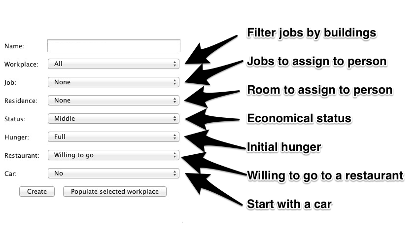

###Importing to Eclipse
  + Simply run Eclipse by clicking on its icon. If it is the first time running Eclipse, you will be prompted for the location of your workspace. Think of the Eclipse Workspace as your "My Documents"/"Documents" directory, but for Eclipse projects. You may use the default location if you wish or make-up your own.
  + Next you import the restaurant application:
    + File -> New -> Other
    + Choose Java Project from Existing Ant Buildfile
    + Click on the Browse button
    + Navigate to the git repository you cloned in the previous section
    + Choose the build.xml file.
    + [IMP]: Check the Link to the buildfile in the file system box
    + Press Finish

###Running the Project
  + To run the main application, navigate to the "RestaurantGui.java" file and press the green run button.
  + To run the tests, navigate to the "CashierTest.java" file and press the run button.

###Adding JUnit
  + JUnit will not be available by default.
  + To import it, first right-click on the src folder in the Eclipse Package Explorer, mouse over "build path," then click "configure build path."
  + Click the "Libraries" tab.
  + Click the "Add Library" button, and find JUnit 3.
  + Click on JUnit3, then press OK to add it.
  + Click OK again to configure the build path.

---
##Introduction

Welcome to Bikini Bottom! Our SimCity models Bikini Bottom from the show Spongebob Squarepants. All images are taken from the show and are not intended to be original art.

##Our Buildings
Picture | Building | Developer | 
--- | --- | ---
 | Restaurant | Erik
 | Bank | Jack
 | Market | Anthony
 | Apartment | Zach
 | Hospital | Victoria

##Our GUI
Bikini Bottom comes with an integrated person creation panel. Click in a hospital to pull it up. Here the user may spawn people with certain names and select roles and residence's.

Our creation panel has two buttons. The "Create" button creates one person with the selected attributes. The "Populate selected workplace" button creates enough people to fill all jobs in the selected workplace, giving them the default attributes and a residence. You may also mix and match combo boxes to create the proper scenario.

###Gui Details
+ The small green squares are citizens of Bikini Bottom walking through the streets
+ The small triangles at the corners of buildings are bus stops, while the larger yellow squares are the buses themselves. Citizens take a bus if they're not assigned a car or are going very far away.
+ The red large squares are cars. Citizens drive cars if they are assigned cars in the creation panel.

##Breakdown of contributions per person
###Diego von Beck
+ Person creation panel (with Victoria)
	+ Classifieds class that keeps track of all WorkRoles by building and availability, and all residential rooms by availability.
	+ Workplace, job, residence, status, hunger level and car checking and setting.
+ Transportation (Buses, cars and walking people) design, implementation and GUI.
	+ Map builder class that creates and links the corners, bus stops, and creates the bus routes.
+ Parsers for configuration files.
+ "Kelp" system for finding routes from one location to another, and finding nearest buildings of a certain type.

###Erik Strottmann
+ PersonAgent and role system design and implementation
+ Time management and scheduling.
+ Role factory
+ Restaurant integration (with Victoria)

###Anthony Cheung
+ Market design, implementation and GUI.
+ Market - Restaurant interaction

###Victoria Dea
+ GUI Main Frame
	+ Building placement and linking
	+ AnimationPanel stacking and display
	+ Person creation panel (with Diego)
		+ Overall GUI structure and placement
		+ Name field checking and assigning.
+ Restaurant integration (with Erik)
+ Image editing and collection for MainFrame and Building role GUIs.
+ Mentored other group members with their AnimationPanel and other GUI elements.

###Zach Vega-Perkins
+ Housing design, implementation and GUI.
  + After clicking on a Pineapple, a view opens up displaying all of the apartments inside a complex. Apartments house all the residents of SimCity including the Landlords and MaintenanceWorkers. Additionally, an info panel pops up with the name of the house.
  + Residents are represented by Spongebob, who has the pet snail Gary. 
+ Abstract GUI classes for animation.
  + Modified Restaurant Gui managers for SimCity.
+ Rent scenarios force trips to bank since the residents rarely have enough money to pay.

###Jack Lucas
+ Bank design, implementation and GUI.
+ Work shift scheduling.
+ Periodic hunger incrementation.

##How to run our system
You will create enough people to cover every employment spot in the city. This is easily done by selecting "All" in the workplace field and pressing the "Populate selected workplace" button. People will the go around living their lives, making decisions based on the time and their attributes.

##Miscellaneous Information
+ Poor people always eat at home. 
+ If they are not poor they can go to the closest restaurant. 
+ People might own a place but live in another.
+ Markets run out of products and can be restocked through GUI.
+ Rents are paid daily

##Unfulfilled requirements
+ We only have apartments, not houses, because we need enough housing to accommodate a large number of people.
+ We only have one type of restaurant in our town.
+ Restaurant excess money is not being deposited in a Bank.
+ We are not incorporating Shared Data between Cook and Waiter.
+ Bank Accounts can be negative.
+ There is no system in place that would result in denying a loan.
+ Restaurants do not order to markets remotely, instead, they use a v2.2 type of market.
+ There should be different behavior on weekends.

